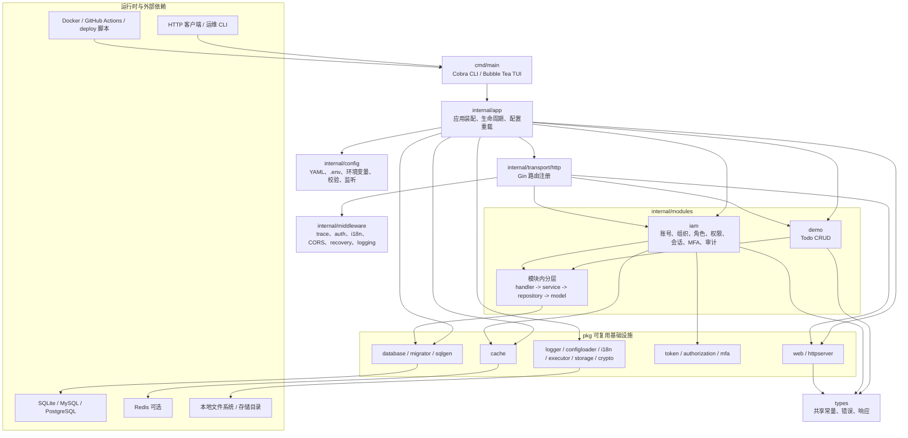

# 项目代号 ｢<ruby>Aoi<rp>（</rp><rt>[葵]</rt><rp>）</rp></ruby>｣

[](https://github.com/rin721/go-scaffold/actions/workflows/ci.yml)
[](https://go.dev/)
[](../LICENSE)
[](https://deepwiki.com/rin721/go-scaffold)

`go-scaffold` 是一个可运行的 Go 后端服务脚手架。当前保留 HTTP 服务、配置加载、结构化日志、数据库访问、Demo Todo CRUD、企业级 IAM、数据库迁移、存储辅助能力、SQL 生成、Docker 构建、CI 检查、部署示例和 AI 运行时文档。

<p align="center">
  
</p>

## 亮点

- 可直接启动的服务入口，支持优雅启动和关闭。
- Demo 模块采用 `handler -> service -> repository -> model` 分层，适合作为新增业务模块参考。
- IAM 模块提供本地账号、组织租户、JWT、Casbin 权限、邀请、找回密码、TOTP MFA、会话撤销和审计日志。
- 迁移通过 `pkg/migrator` 封装 goose，并由 `db migrate` 显式执行。
- 本地默认配置使用 SQLite `./data/app.db`，Redis 默认关闭，Demo 模块默认开启，HTTP 监听 `127.0.0.1:9999`。
- 提供 Docker、Compose、环境变量、部署脚本和 CI 示例。

## 技术栈

| 范围 | 技术 |
| --- | --- |
| 运行时 | Go 1.25.7 |
| HTTP | `pkg/web` 防腐封装,底层使用 Gin 和 gin-contrib/cors |
| CLI | `pkg/cli` 封装 Cobra 命令路由和 Charm Bubble Tea/Lip Gloss v2 交互首页 |
| 配置 | `pkg/configloader` 防腐封装,支持 YAML、dotenv 和环境变量覆盖 |
| 日志 | Zap, lumberjack |
| 数据库 | `pkg/database` 防腐封装,底层支持 SQLite、MySQL、PostgreSQL |
| 迁移 | `pkg/migrator` 防腐封装，底层使用 goose |
| 认证 | `pkg/token` 封装 JWT 和 refresh token hash |
| 权限 | `pkg/authorization` 封装 Casbin domain RBAC |
| MFA | `pkg/mfa` 封装 TOTP |
| 缓存 | `pkg/cache` 封装 go-redis，可选启用 |
| 国际化 | go-i18n，包含 `zh-CN` 和 `en-US` 示例 |
| 存储 | afero, mimetype, imaging |
| SQL/代码生成 | 本地 `pkg/sqlgen`, Jennifer |
| 后台任务 | ants 协程池管理 |
| 测试 | Go test, miniredis |
| CI 和交付 | GitHub Actions, Docker, Docker Compose 示例 |

## 架构图



## 快速启动

```bash
go run ./cmd/main
```

无参数运行会进入 `pkg/cli` 提供的交互式首页，可浏览已注册命令并查看帮助。

```bash
go run ./cmd/main server
```

```bash
curl http://127.0.0.1:9999/health
curl http://127.0.0.1:9999/ready
```

```bash
go test ./... -count=1
go build -trimpath -ldflags="-s -w" -o bin/go-scaffold-server ./cmd/main
docker build -t go-scaffold:local .
```

## 主要入口

| 范围 | 路径 |
| --- | --- |
| CLI 入口 | `cmd/main` |
| 应用装配 | `internal/app` |
| 配置 | `internal/config`, `configs` |
| HTTP 传输层 | `internal/transport/http` |
| Demo 模块 | `internal/modules/demo` |
| IAM 模块 | `internal/modules/iam` |
| 基础设施包 | `pkg/database`, `pkg/web`, `pkg/configloader`, `pkg/cache`, `pkg/logger`, `pkg/httpserver`, `pkg/storage`, `pkg/sqlgen`, `pkg/token`, `pkg/authorization`, `pkg/mfa`, `pkg/migrator` |
| 共享响应和错误类型 | `types` |
| Docker 和部署 | `Dockerfile`, `deploy`, `deploy.sh`, `script/install.sh` |
| 工程文档 | `docs/README.md`, `docs` |

## 工程文档索引

`docs/README.md` 是当前工程文档入口。`docs/ai` 是独立的 AI 运行时状态树，用于保存任务状态、证据、决策、知识和交接信息；普通工程阅读优先从下面的结构化文档开始。

### 推荐阅读顺序

1. [新人接手指南](onboarding/getting-started.md)
2. [项目概述](overview/project.md)
3. [目录地图](structure/directory-map.md)
4. [配置说明](environment/configuration.md)
5. [分层架构](architecture/layers.md)
6. [启动流程](runtime/startup-flow.md)
7. [HTTP 流程](runtime/http-flow.md)
8. [API 文档](api/http-api.md)
9. [配置流程](runtime/config-flow.md)
10. [错误流程](runtime/error-flow.md)
11. [Demo 模块](modules/demo.md)
12. [IAM 模块](modules/iam.md)
13. [DB CLI 工作流](workflows/db-cli.md)
14. [IAM CLI 工作流](workflows/iam-cli.md)
15. [测试矩阵](testing/test-matrix.md)
16. [Docker 和 CI](build/docker-and-ci.md)
17. [部署说明](release/deployment.md)
18. [维护指南](maintenance/maintenance-guide.md)
19. [已知缺口](backlog/known-gaps.md)

### 文档地图

| 分区 | 内容概述 |
| --- | --- |
| [onboarding](onboarding/getting-started.md) | 面向 Go 新手和新维护者的第一篇阅读、启动和接手路径 |
| [overview](overview/project.md) | 当前能力、非目标和运行时默认假设 |
| [structure](structure/directory-map.md) | 目录职责和依赖方向 |
| [environment](environment/configuration.md) | 配置文件、环境变量、`.env` 和生产示例 |
| [architecture](architecture/layers.md) | 应用分层和装配方式 |
| [runtime](runtime/startup-flow.md) | 启动、HTTP、配置重载、状态和错误流程 |
| [api](api/README.md) | 人可读 HTTP API 文档和 OpenAPI 契约 |
| [modules/demo](modules/demo.md), [modules/iam](modules/iam.md) | Demo 和 IAM 模块说明 |
| [workflows/db-cli](workflows/db-cli.md), [workflows/iam-cli](workflows/iam-cli.md) | DB/IAM CLI 和运维型命令 |
| [testing](testing/test-matrix.md) | 测试归属和验证命令 |
| [build](build/docker-and-ci.md) | CI、本地构建、Docker 构建和质量门禁 |
| [release](release/deployment.md) | 生产配置、部署脚本和发布检查 |
| [extension](extension/adding-modules.md) | 新增模块、配置和 API 的方式 |
| [maintenance](maintenance/maintenance-guide.md) | 长期维护工作流 |
| [backlog](backlog/known-gaps.md) | 当前已知实现和文档缺口 |

## API 范围

详细 API 说明见 [HTTP API 文档](api/http-api.md)，机器可读契约见
[OpenAPI YAML](api/openapi.yaml)。

| 路由 | 用途 |
| --- | --- |
| `GET /health` | 进程存活检查 |
| `GET /ready` | 包含数据库 ping 的就绪检查 |
| `POST /api/v1/demo/todos` | 创建 Demo Todo |
| `GET /api/v1/demo/todos` | 列出 Demo Todo |
| `GET /api/v1/demo/todos/:id` | 读取单个 Demo Todo |
| `PUT /api/v1/demo/todos/:id` | 更新单个 Demo Todo |
| `DELETE /api/v1/demo/todos/:id` | 删除单个 Demo Todo |
| `POST /api/v1/auth/login` | IAM 登录 |
| `POST /api/v1/auth/refresh` | IAM refresh token 轮换 |
| `POST /api/v1/auth/logout` | IAM 登出并撤销当前会话 |
| `POST /api/v1/auth/password/forgot` | 发起密码找回 |
| `POST /api/v1/auth/password/reset` | 重置密码 |
| `POST /api/v1/invitations/:token/accept` | 接受组织邀请 |
| `GET /api/v1/me` | 当前用户资料 |
| `GET /api/v1/me/orgs` | 当前用户组织 |
| `/api/v1/orgs`, `/api/v1/users/*`, `/api/v1/roles`, `/api/v1/permissions`, `/api/v1/sessions`, `/api/v1/audit-logs` | IAM 管理接口 |

## 配置

本地配置从 `configs/config.yaml` 或 `configs/config.example.yaml` 开始。运行时也可以通过环境变量和 `.env` 覆盖配置值。

推荐参考：

- `environment/configuration.md`
- `../.env.example`
- `../deploy/config.production.example.yaml`

## 数据库 CLI

`db` 命令由 `cmd/main` 声明为 `cli.CommandSpec`。Demo SQL 生成和执行保持在 `internal/app/dbapp`，迁移由 `pkg/migrator` 封装 goose。

```bash
go run ./cmd/main db --operation=schema
go run ./cmd/main db --operation=schema --apply
go run ./cmd/main db --operation=todo-list
go run ./cmd/main db migrate status
go run ./cmd/main db migrate up
```

## IAM CLI

```bash
go run ./cmd/main iam bootstrap-admin --org-code=acme --username=admin --email=admin@example.com --password-stdin
```

该命令用于首次创建组织、管理员、内置权限和 owner/admin/member 角色。生产环境应先显式执行 `db migrate up`，并通过标准输入或 secrets 管道传入密码。

## 工程工作流

```bash
gofmt -w ./cmd ./internal ./pkg ./types
go test ./... -count=1 -mod=readonly
go build -mod=readonly -o ./tmp/go-scaffold-server ./cmd/main
docker build -t go-scaffold:ci .
```

## 生产提示

生产示例默认关闭 Demo 模块。除非明确需要，不要在生产或类生产环境暴露 Demo 路由，也不要隐式创建 Demo 表结构。

真实部署前需要审查数据库、Redis、存储、日志、CORS、健康/就绪检查、备份和回滚策略。

## IDE

建议使用以下任意平台进行开发：

[](https://code.visualstudio.com/)

## 格式规范

* **缩进：** 2 Spaces (当前项目配置) / TAB (模板建议)
* **行尾：** LF
* **引号：** 双引号
* **文件末尾**加空行
* **Api 风格：**
  * RESTful 风格，HTTP 状态码语义化
  * JSON 响应，`Content-Type: application/json`
  * 错误响应包含 `code`、`message`、`details` 字段
  * 分页列表响应包含 `items`、`total`、`page`、`page_size` 字段

## 许可证

本项目使用 [MIT License](../LICENSE)。
